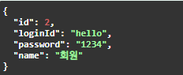

## 프로젝트 소개
스프링 부트를 사용하여 REST API 서비스와 사용자 관리 기능을 구현한 간단한 프로젝트입니다.   
회원 정보를 CRUD(생성, 조회, 수정, 삭제)할 수 있는 기능을 제공하며, RESTful 서비스뿐만 아니라 사용자에게 뷰(View)를 제공하는 웹 페이지도 포함되어 있습니다.

### 주요 기능
#### 1. REST API 서비스
- 회원 정보에 대한 RESTful CRUD API 제공.
- JSON 형식의 데이터를 반환하며, 다양한 클라이언트와 연동 가능.
- 엔드포인트 예시:
    - GET /api/members: 회원 목록 조회.
    - POST /api/members: 회원 추가.
    - PUT /api/members/{id}: 회원 정보 수정.
    - DELETE /api/members/{id}: 회원 삭제.

#### 2. 사용자 관리 웹 애플리케이션
- Thymeleaf를 사용하여 HTML 기반의 사용자 관리 화면 제공.
- 회원 목록, 상세 정보, 수정 폼 등의 화면 구성.
- 웹 브라우저를 통해 간단한 회원 관리 작업 가능.

### 사용 기술 스택
- Spring Boot: 애플리케이션 프레임워크.
- Thymeleaf: HTML 템플릿 엔진.
- H2 Database: 데이터 저장 및 테스트를 위한 경량형 데이터베이스.
- Spring Data JDBC: 데이터 접근 계층 구현.

### 프로젝트 동작 화면

#### 회원 관리 시스템 UI 및 동작 예시

#### REST API 및 사용자 관리 화면 동작

##### 회원 저장

#### 회원 조회

#### 회원 목록 조회

#### 회원 정보 수정

#### 회원 정보 삭제

### 추가 구현 예정
#### 1. 데이터 접근 기술 개선 및 확장
- 기존 JDBC를 단계적으로 개선:
- JDBCTemplate: 코드 간결화 및 효율적인 데이터베이스 접근.
- MyBatis: SQL 매핑 기능 추가 및 동적 쿼리 처리.
- JPA: ORM 기반 데이터베이스 접근으로 객체와 데이터 매핑.
- Spring Data JPA: JPA의 간소화 및 생산성 향상.
- 여러 데이터 접근 기술을 사용하면서 데이터 접근 기술을 학습할 예정입니다.

#### 2. 데이터베이스 확장
- 현재 H2 데이터베이스를 MySQL 또는 OracleSQL로 변경하여 상용 환경에 적합한 데이터베이스 구조 적용.
- 여러 데이터베이스를 사용해보고, 최종적으로 Docker를 활용하여 데이터베이스를 컨테이너화해 배포 환경에서 쉽게 관리할 수 있도록 구성해볼 생각입니다.
