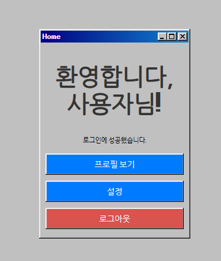
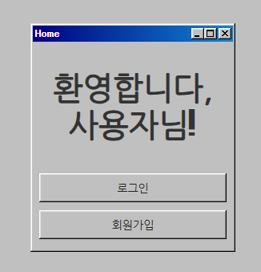
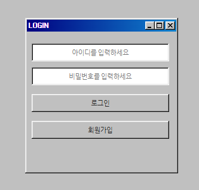
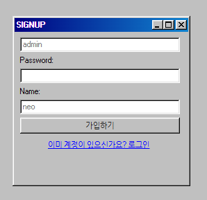

# MyBoard Web Application

MyBoard 웹 애플리케이션은 로그인, 회원가입, 홈 화면을 제공하는 간단한 웹 애플리케이션입니다. 이 프로젝트는 Spring Boot와 타임리프를 사용하여 구현되었습니다.

## 목차

- [설치 및 실행](#설치-및-실행)
- [기능](#기능)
- [페이지 스크린샷](#페이지-스크린샷)
- [REST API](#rest-api)
- [사용된 기술](#사용된-기술)
---

## 기능
- 로그인: 등록된 사용자가 아이디와 비밀번호를 통해 로그인할 수 있습니다.
- 회원가입: 새로운 사용자가 아이디, 비밀번호, 닉네임을 입력하여 계정을 생성할 수 있습니다.
- 홈 화면: 로그인한 사용자가 접근할 수 있는 홈 화면으로, 사용자 프로필 및 로그아웃 버튼을 제공합니다.
- 로그아웃: 현재 세션을 종료하고 로그인 페이지로 돌아갑니다.
- 게시글 : 기능 추가 예정

---

## 페이지 스크린샷

### 홈 화면 - 로그인 상태
로그인한 사용자가 홈 화면에 접속할 경우, "환영합니다, 사용자님!" 메시지와 함께 프로필 보기, 설정, 로그아웃 버튼이 나타납니다.

### 홈 화면 - 비로그인 상태
로그인하지 않은 사용자가 접근할 경우, 로그인 및 회원가입 버튼이 나타납니다.

### 로그인 페이지
사용자가 아이디와 비밀번호를 입력하여 로그인할 수 있는 페이지입니다.

### 회원가입 페이지
새로운 계정을 만들기 위해 아이디, 비밀번호, 이름을 입력하는 페이지입니다. 이미 계정이 있을 경우 로그인 링크를 통해 로그인 페이지로 이동할 수 있습니다.

---

## REST API
MyBoard 애플리케이션은 REST API를 통해 회원 정보를 관리할 수 있습니다.

| HTTP Method | Endpoint             | Description           |
|-------------|----------------------|-----------------------|
| GET         | /api/members         | 모든 회원 조회        |
| GET         | /api/members/{id}    | 특정 회원 조회        |
| POST        | /api/members         | 새로운 회원 생성      |
| PUT         | /api/members/{id}    | 특정 회원 정보 수정   |
| DELETE      | /api/members/{id}    | 특정 회원 삭제        |

---

## 사용된 기술
- Backend: Spring Boot, Spring Data JPA
- Frontend: Thymeleaf, HTML/CSS
- Database: H2 Database (임베디드 데이터베이스로 설정)
- 빌드 도구: Gradle